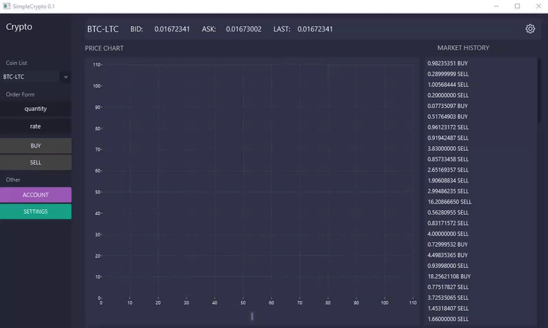

## BITTREX JAVA WRAPPER


### USAGE


PUBLIC 
```JAVA
    //returns a string
    bittrexAPI.getMarkets();
    bittrexAPI.getCurrencies();
    bittrexAPI.getMarketSummaries();
    bittrexAPI.getMarketSummary("MARKET NAME");
    bittrexAPI.getTicker("MARKET NAME");
    bittrexAPI.getOrderBook("MARKET NAME");
    bittrexAPI.getMarketHistory("MARKET NAME");
```
ACCOUNT 
```JAVA

    bittrexAPI.setAPIKeys("APIKEY","SECRETKEY");
    
    //returns a string
    bittrexAPI.getBalances();
    bittrexAPI.getBalance("MARKET NAME");
    bittrexAPI.getOrderHistory("MARKET NAME");
    bittrexAPI.getOrder("UUID");
    bittrexAPI.getWithdrawalHistory("MARKET NAME");
    bittrexAPI.getDepositAddress("MARKET NAME");
    bittrexAPI.Withdraw("MARKET NAME", "QUANTITY", "ADDRESS");
```
MARKET 
```JAVA

    bittrexAPI.setAPIKeys("APIKEY","SECRETKEY");
    
    //returns a string
    bittrexAPI.buyLimit("MARKET NAME" , "QUANTITY" , "RATE");
    bittrexAPI.sellLimit("MARKET NAME" , "QUANTITY" , "RATE");
    bittrexAPI.cancelOrder("UUID");
    bittrexAPI.getOpenOrders("MARKET NAME");
```

Simple ArrayList

```JAVA
    bittrexData data = new bittrexData();

    data.set( bittrexAPI.getMarkets() );
    
    System.out.println( data.size() );
    
    for(int b = 0; b < data.size(); b++) {
	    System.out.println( a.get(b, "BaseCurrency") );
    }
    
    data.printAllElements();
    
```
1
```JAVA
    bittrexData data = new bittrexData();

    ArrayList<ArrayList<String>> a = getObject();
    
```
2
```JAVA
     bittrexAPI.setAPIKeys("APIKEY","SECRETKEY");
     
     bittrexData data = new bittrexData();
    
     System.out.println( a.get("CryptoAddress") );
     
```


### Quick Start

```JAVA
    // PUBLIC
    public static void main(String[] args) {
    
    bittrexData data = new bittrexData();
    
    data.set(bittrexAPI.getMarkets());
    
    for(int b = 0; b < data.size(); b++) {
	    System.out.println( data.get( b , "MarketName") );
    }
    
    /* OUTPUT
      BTC-LTC
      BTC-DOGE
      ...
    */
    
     // ACCOUNT
     bittrexAPI.setAPIKeys("APIKEY","SECRETKEY");
     bittrexData data2 = new bittrexData();
    
     System.out.println( a.get("CryptoAddress") );
     
     }
    
```




